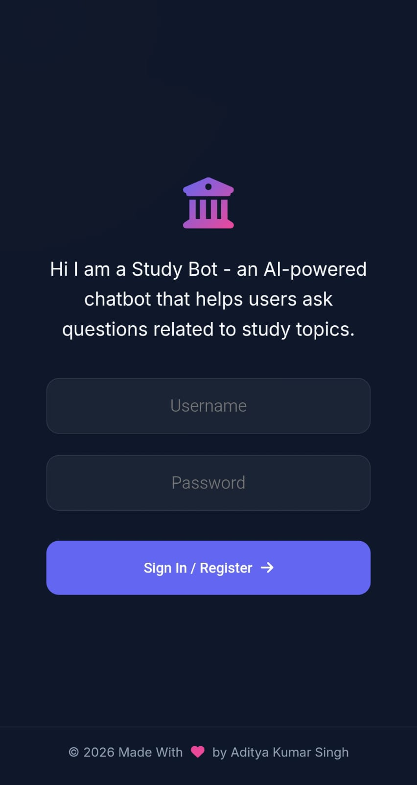
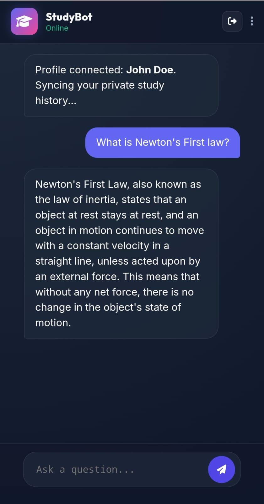

# Study Bot - AI Powered Learning Assistant

An AI-powered chatbot that answers **study-related questions** and maintains **user-specific conversation memory** using MongoDB.

---

## 🚀 Live Links

- 🌐 **Frontend (GitHub Pages):**  
https://adityaxletscode.github.io/StudyBot-----An-intelligent-AI-learning-companion/

- 🔗 **Backend API (Render):**  
https://studybot-an-intelligent-ai-learning.onrender.com

- 📂 **GitHub Repository:**  
https://github.com/Adityaxletscode/StudyBot-----An-intelligent-AI-learning-companion

---

## 📌 Project Overview

Study Bot is a full-stack AI chatbot designed to:

- Answer study-related questions only
- Provide secure login/register functionality
- Store chat history in MongoDB Atlas
- Maintain contextual conversation memory
- Deploy backend on Render and frontend on GitHub Pages

The backend is built using FastAPI and integrates a Groq LLM (openai/gpt-oss-20b).  
The frontend is built using HTML, CSS, and JavaScript.

---

## 🛠 Tech Stack

- Backend: FastAPI (Python)
- Database: MongoDB Atlas
- AI Model: Groq LLM (openai/gpt-oss-20b)
- Authentication: Passlib (pbkdf2_sha256 & bcrypt)
- Frontend: HTML, CSS, JavaScript
- Deployment: Render + GitHub Pages

---

## 🧠 Memory Implementation

Memory is implemented using MongoDB.

Each message is stored with:

- user_id
- role (user or assistant)
- message
- timestamp

### How it works:

1. User sends a question.
2. Backend fetches previous messages from MongoDB.
3. Messages are sorted chronologically.
4. History is passed into the LLM using LangChain MessagesPlaceholder.
5. AI generates contextual response.
6. Both user and assistant messages are stored immediately.

This ensures persistent conversation memory.

---

## 🔐 Authentication System

- Users must provide username and password.
- If user does not exist → account is created.
- Passwords are hashed using Passlib before storing.
- Only authenticated users can access chat and history.

---

## 📡 API Endpoints

GET     /           → Health check  
GET     /health     → Server status  
POST    /auth       → Register/Login  
POST    /chat       → Send question  
POST    /history    → Get chat history  

### Example Chat Request

{
  "question": "What is Newton's First Law?",
  "user_id": "aditya",
  "password": "1234"
}

---

## 💻 Frontend Structure

- index.html
- script.js
- style.css

Handles:

- Authentication UI
- Chat rendering
- Typing indicators
- History synchronization
- API communication

---

## 📸 Screenshots

### 🔑 Login Page

### 💬 Chat Page

---

## 🧪 Testing the API

You can test using:

- Postman
- Thunder Client (VS Code)
- Browser (GET endpoints)

---

## 🎯 Key Features

- Study-only AI assistant
- Persistent chat memory
- Secure password hashing
- MongoDB cloud integration
- Production deployment
- Clean responsive UI

---

## 🏁 Conclusion

Study Bot demonstrates full-stack AI integration combining:

- LLM APIs
- Secure authentication
- Database-based memory
- Cloud deployment

It is a practical example of building an intelligent assistant with persistent memory.

---

